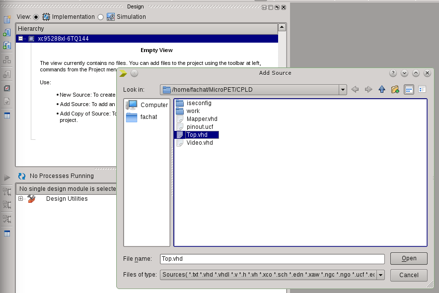
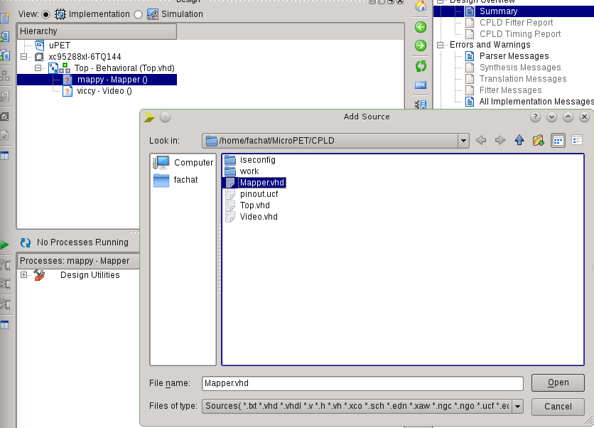
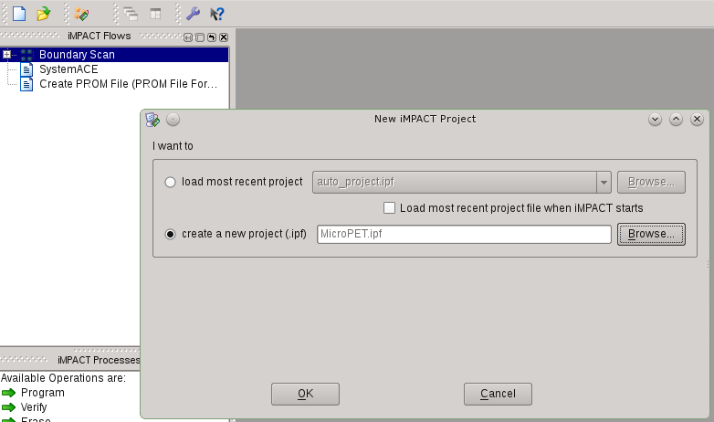
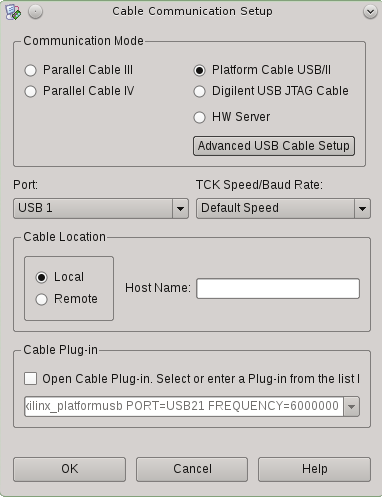
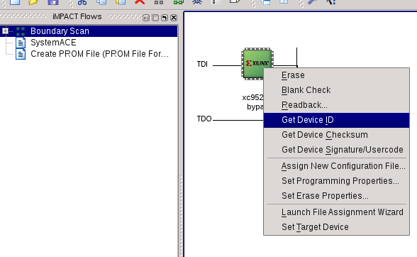
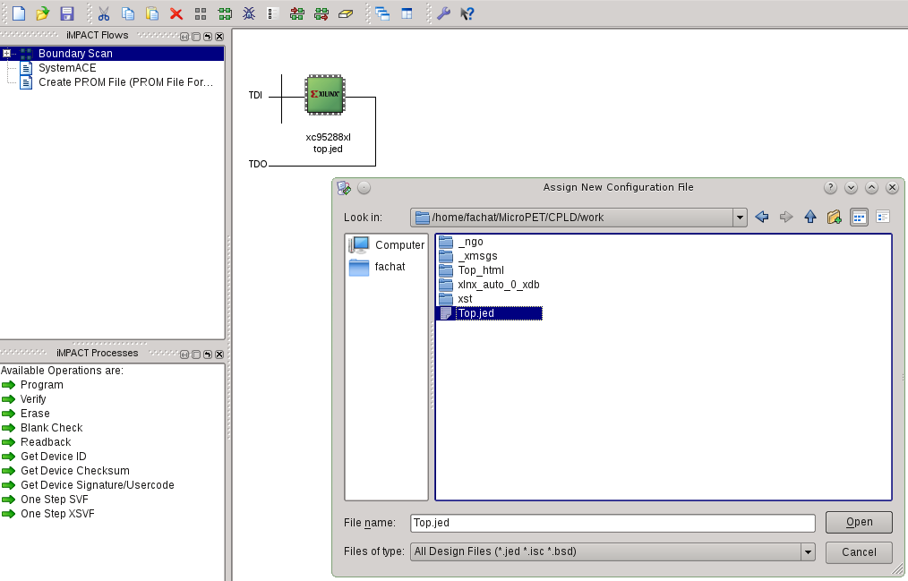

# Build setup for the CPLD

## WebISE

The xc95xxx CPLDs are only supported by the WebISE software available for download from Xilinx.
Support has not (yet to my knowledge) been integrated into their new Vivado software.

### Setting up the project

When you start WebISE, you have to create a new project. 

Use this CPLD folder as project folder, and a "work" subfolder as work folder. It is better not to use the same folder, as 
in the work folder many files are created that clutter the folder only.

Then setup the project as shown in this images

Under the project, "Add Source" and add the "Top.vhd" VHDL file

Then add the other VHDL files underneath by assigning the VHDL files to their respective components.
Note that for the Video and Clock components, two options are available, Composite video out or VGA (640x480) output.

Finally, add the constraints file

In the process properties, set "Speed" as optimization goal, and optimization effort to "High".

Set "Optimize Density" for the Fitting.

Then you can build the "Top.jed" file by clicking the green triangle to start the build.

### Programming the CPLD

To program the CPLD, the "iMPACT" tool is used, that is part of the WebISE package.

Here you have to create a new project too.

Connect the USB JTAG cable to the PC, attach the JTAG wires to the probe connector on the Micro-PET board, and power it up.
Then let iMPACT automatically detect the CPLD

It may be possible to use other cables, to set them up use the Output/Device Setup menu

Right-clicking on the Device and reading the Device ID is a good check if the cable works

Then assign a configuration file to the CPLD

After that, you can right-click on the CPLD device on display and select "Program" to program the configuration into the CPLD.

